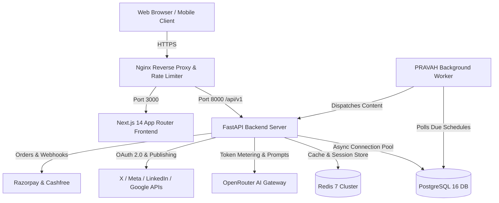

# PRAVAH Architecture Documentation

## 1. System Topology

---

## 2. Multi-Tenant Context Model

PRAVAH enforces organization-level isolation across all entity operations using dependency injection:

1. **`get_current_user`**: Authenticates JWT bearer token, checks revocation in session registry, and loads user profile.
2. **`get_tenant_context`**:
   - Resolves `X-Organisation-Id` header (or primary organization).
   - Validates user membership in the requested organization.
   - Extracts assigned role and role permissions (28+ granular flags).
   - Checks global/org emergency stop status.
3. **`require_permission(perm_name)`**: Enforces specific RBAC permission (e.g., `content.publish`, `social.connect`, `billing.manage`) before route execution.

---

## 3. Visual Workflow DAG Engine

The workflow engine executes arbitrary directed acyclic graphs topologically:

- **Node Types**:
  - `trigger_manual`, `trigger_schedule`, `trigger_webhook`
  - `ai_generate_text`, `ai_generate_image`
  - `logic_condition`, `logic_delay`
  - `team_approval_gate`
  - `social_publish_x`, `social_publish_linkedin`, `social_publish_facebook`, `social_publish_instagram`, `social_publish_youtube`
- **Topological Sorting**: Detected cycles trigger validation errors before saving.
- **Node Execution Isolation**: Each node execution records start timestamp, finish timestamp, duration, output JSON payload, and error telemetry.

---

## 4. Algorithmic Best-Time Recommendation Engine

Calculates optimal posting windows based on:
1. Historical organization post impressions and engagement spikes.
2. Platform benchmark distribution curves (e.g. X peak at 9:00 AM - 11:00 AM; LinkedIn peak on Tue/Thu morning).
3. Confidence score aggregation and reason explainability.
