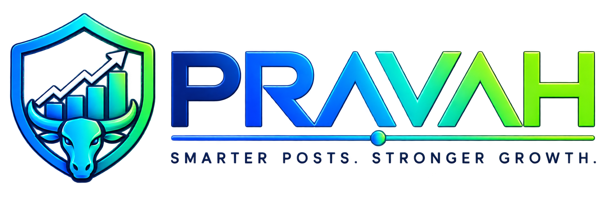

<div align="center">
  
  <p><strong>The AI Social Media Management & Visual Workflow Automation SaaS Platform</strong></p>

  [](https://python.org)
  [](https://fastapi.tiangolo.com)
  [](https://nextjs.org)
  [](LICENSE)
  []()
</div>

---

## 🌟 Executive Overview

**PRAVAH** (प्रवाह — Sanskrit for *continuous flow*) is an enterprise-grade, multi-tenant AI social media management, intelligent scheduling, and visual DAG automation operating system.

It is built from first principles to eliminate fragmented scripts and legacy tools by unifying brand intelligence, frontier LLM routing, official OAuth social publishing, multi-tier team review workflows, and visual DAG automation into a single platform.

---

## 🚀 Key Architectural Features

- 🏢 **Strict Multi-Tenant Architecture & RBAC**: Organization workspace isolation, 28+ granular permissions, custom roles, invitation tokens, and zero cross-tenant IDOR vulnerabilities.
- 🤖 **AI Studio & Brand Voice Intelligence**: OpenRouter routing (400+ frontier models: Claude 3.5, GPT-4o, Llama 3), brand persona memory, platform limit adaptors, and image rendering.
- ⚡ **React Flow Visual DAG Workflows**: Drag-and-drop workflow canvas with triggers, conditional logic, AI nodes, approval gates, and multi-channel distribution.
- 📱 **Official Social API Connect**: Full OAuth 2.0 authorization for **X (Twitter)**, **Facebook Pages**, **Instagram Business**, **LinkedIn Profiles & Pages**, and **YouTube**.
- ⏰ **Algorithmic Best-Time Recommendation Engine**: Historical engagement spike analysis and platform benchmark indices for optimal peak posting windows.
- 💳 **Payment Gateways & Real Usage Metering**: Automated usage tracking (posts, tokens, images, accounts, workflows, members) with Razorpay and Cashfree checkout.
- 🛡️ **Cryptographic Security**: AES-256 Fernet encrypted OAuth credentials and secrets, Argon2 password hashing, TOTP 2FA (Google Authenticator), and immutable audit logs.
- 🧙 **First-Run Interactive Setup Wizard (`/setup`)**: 7-step wizard initializing the Super Admin, seeding default Free plans, permissions, and locking automatically post-setup.
- 📄 **Dynamic CMS & Compliance Legal Pages**: Database-driven visual blocks and contact form submissions for `/terms`, `/privacy`, `/refund`, `/cookie-policy`, `/security`, `/acceptable-use`, and `/ai-policy`.

---

## 🏗️ Repository Layout

```
Pravah/
├── apps/
│   ├── api/                   # FastAPI Backend (Python 3.12, SQLAlchemy 2.0, Alembic)
│   │   ├── app/
│   │   │   ├── api/           # API v1 Router & Multi-Tenant Dependency Injectors
│   │   │   ├── core/          # Pydantic Config, Database Engine, Encryption, Security
│   │   │   ├── models/        # 45+ Normalized SQLAlchemy Entities
│   │   │   ├── schemas/       # Strict Pydantic V2 Request/Response Contracts
│   │   │   ├── services/      # Business Logic (AI, RBAC, Publishing, Workflows, Billing)
│   │   │   └── workers/       # Background Scheduler Loop
│   │   └── tests/             # Automated Pytest Suite
│   └── web/                   # Next.js 14 App Router Frontend
│       ├── app/               # Public, Auth, Dashboard, Setup & Super Admin Routes
│       ├── components/        # Glassmorphic UI Library (Modal, Button, Card, Toast)
│       ├── lib/               # Typed API Client & Formatting Helpers
│       ├── providers/         # Auth, Organisation & Toast Providers
│       └── public/            # Device-Compatible Favicons, Manifest & Master Logos
├── packages/
│   └── shared-types/          # Shared TypeScript Data Contracts
├── infrastructure/
│   ├── docker/                # Multi-stage Dockerfiles (API & Web)
│   └── nginx/                 # Reverse Proxy, Security Headers & Rate Limits
├── scripts/
│   └── generate_icons.py      # Device-Compatible Icon Generator
├── docker-compose.yml         # Local & Staging Orchestration Stack
├── docker-compose.prod.yml    # Production Stack with Nginx & SSL
└── prd.md                     # Authoritative Product Requirements Document
```

---

## ⚡ Quick Start (Local Development)

### 1. Backend Setup (`apps/api`)

```bash
cd apps/api
python -m venv .venv
# On Windows:
.venv\Scripts\activate
# On Linux/macOS:
source .venv/bin/activate

pip install -r requirements.txt
uvicorn app.main:app --reload --port 8000
```

### 2. Frontend Setup (`apps/web`)

```bash
cd apps/web
npm install
npm run dev
```

Visit `http://localhost:3000/setup` to complete the initial setup wizard.

---

## 🧪 Running the Test Suite

```bash
# Backend Pytest Suite
cd apps/api
pytest tests/ -v

# Frontend TypeScript Typecheck
cd apps/web
npm run typecheck

# Frontend Production Build
npm run build
```

---

## 🐳 Docker Deployment

```bash
cp .env.example .env
docker compose up --build -d
```

---

## 📜 License

MIT License © 2026 PRAVAH Platform Technologies.
